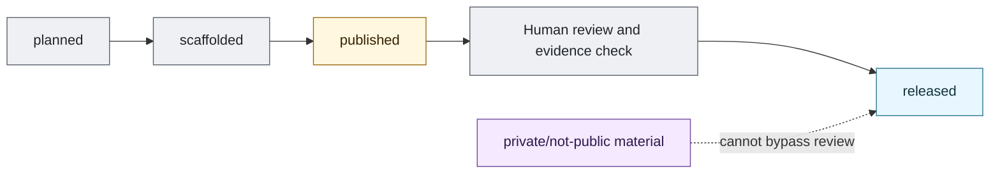

# Release Readiness Flow

## Purpose

This graph maps the minimum path from planned item to released artifact.

## Mermaid Diagram

## Interpretation Notes

- A published repo can host scaffolding before any artifact is released.
- Human review and evidence are the gate to `released`.

## Boundary Notes

- Private/not-public material cannot be converted to released material by summary or implication.
- Hugging Face is a release surface only.

## Follow-Up Actions

- Store review checklists with future release candidates.
- Update the audit when a status changes.
