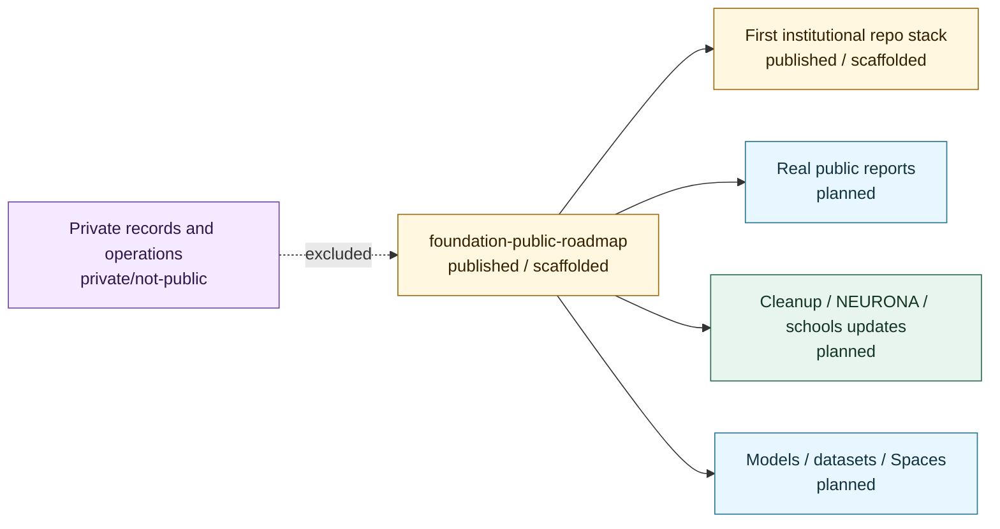

# Roadmap Map

## Purpose

This graph shows how the public roadmap tracks repo state without making live-operation claims.

## Mermaid Diagram

## Interpretation Notes

- The roadmap records statuses and review gates.
- Future artifacts remain planned until reviewed evidence exists.

## Boundary Notes

- Roadmap visibility does not reveal private operations or sensitive records.
- Planned items are not active services or commitments.

## Follow-Up Actions

- Keep ROADMAP.md and STATUS.md synchronized.
- Add evidence links before changing any item to `released`.
